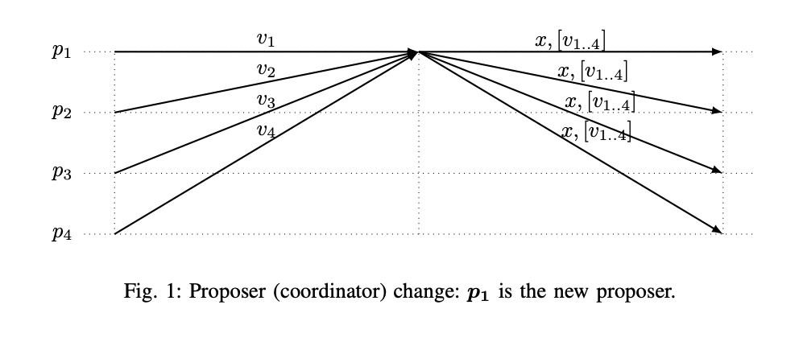

# The latest gossip on BFT consensus
> https://arxiv.org/pdf/1807.04938.pdf
>Ethan Buchman, Jae Kwon and Zarko Milosevic
>
> Tendermint
>
> eptember 24, 2018

## Abstract

The paper presents Tendermint, a new protocol for ordering events in a distributed network under adversarial conditions. More commonly known as Byzantine Fault Tolerant (BFT) consensus or atomic broadcast, the problem has attracted significant attention in recent years due to the widespread success of blockchain-based digital currencies, such as Bitcoin and Ethereum, which successfully solved the problem in a public setting without a central authority. Tendermint modernizes classic academic work on the subject and simplifies the design of the BFT algorithm by relying on a peer-to-peer gossip protocol among nodes.

## I. INTRODUCTION

Consensus is one of the most fundamental problems in distributed computing. It is important because of it’s role in State Machine Replication (SMR), a generic approach for replicating services that can be modeled as a deterministic state machine [1], [2]. The key idea of this approach is that service replicas start in the same initial state, and then execute requests (also called transactions) in the same order; thereby guaranteeing that replicas stay in sync with each other. The role of consensus in the SMR approach is ensuring that all replicas
receive transactions in the same order. Traditionally, deployments of SMR based systems are in data-center settings (local area network), have a small number of replicas (three to seven) and are typically part of a single administration domain (e.g., Chubby [3]); therefore they handle benign (crash) failures only, as more general forms of failure (in particular, malicious or Byzantine faults) are considered to occur with only negligible probability.

The success of cryptocurrencies or blockchain systems in recent years (e.g., [4], [5]) pose a whole new set of challenges on the design and deployment of SMR based systems: reaching agreement over wide area network, among large number of nodes (hundreds or thousands) that are not part of the same administration domain, and where a subset of nodes can behave maliciously (Byzantine faults). Furthermore, contrary to the previous data-center deployments where nodes are fully connected to each other, in blockchain systems, a node is only connected to a subset of other nodes, so communication is achieved by gossip-based peer-to-peer protocols. The new requirements demand designs and algorithms that are not necessarily present in the classical academic literature on Byzantine fault tolerant consensus (or SMR) systems (e.g., [6], [7]) as the primary focus was different setup.

In this paper we describe a novel Byzantine-fault tolerant consensus algorithm that is the core of the BFT SMR platform called $Tendermint^{[1]}$. The Tendermint platform consists of a high-performance BFT SMR implementation written in Go, a flexible interface for building arbitrary deterministic applications above the consensus, and a suite of tools for deployment and management.

The Tendermint consensus algorithm is inspired by the PBFT SMR algorithm [8] and the DLS algorithm for authenticated faults (the Algorithm 2 from [6]). Similar to DLS algorithm, Tendermint proceeds in rounds2 , where each round has a dedicated proposer (also called coordinator or leader) and a process proceeds to a new round as part of normal processing (not only in case the proposer is faulty or suspected as being faulty by enough processes as in PBFT). The communication pattern of each round is very similar to the ”normal” case of PBFT. Therefore, in preferable conditions (correct proposer, timely and reliable communication between correct processes), Tendermint decides in three communication steps (the same as PBFT).

The major novelty and contribution of the Tendermint consensus algorithm is a new termination mechanism. As explained in [9], [10], the existing BFT consensus (and SMR) algorithms for the partially synchronous system model (for example PBFT [8], [6], [11]) typically relies on the communication pattern illustrated in Figure 1 for termination. The Figure 1 illustrates messages exchanged during the proposer change when processes start a new round3 . It guarantees that eventually (ie. after some Global Stabilization Time, GST), there exists a round with a correct proposer that will bring the system into a univalent configuration. Intuitively, in a round in which the proposed value is accepted by all correct processes, and communication between correct processes is timely and reliable, all correct processes decide.



To ensure that a proposed value is accepted by all correct processes4
a proposer will 1) build the global state by receiving messages from other processes, 2) select the safe value to propose and 3) send the selected value together with the signed messages received in the first step to support it. The value vi that a correct process sends to the next proposer normally corresponds to a value the process considers as acceptable for a decision:

- in PBFT [8] and DLS [6] it is not the value itself but a set of 2f + 1 signed messages with the same value id,
- in Fast Byzantine Paxos [11] the value itself is being sent.

In both cases, using this mechanism in our system model (ie. high number of nodes over gossip based network) would have high communication complexity that increases with the number of processes: in the first case as the message sent depends on the total number of processes, and in the second case as the value (block of transactions) is sent by each process. The set of messages received in the first step are normally piggybacked on the proposal message (in the Figure 1 denoted with [v1..4]) to justify the choice of the selected value x. Note that sending this message also does not scale with the number of processes in the system.

We designed a novel termination mechanism for Tendermint that better suits the system model we consider.It does not require additional communication (neither sending new messages nor piggybacking information on the existing messages) and it is fully based on the communication pattern that is very similar to the normal case in PBFT [8]. Therefore, there is only a single mode of execution in Tendermint, i.e., there is no separation between the normal and the recovery mode, which is the case in other PBFT-like protocols (e.g., [8], [12] or [13]). We believe this makes Tendermint simpler to understand and implement correctly.

Note that the orthogonal approach for reducing message complexity in order to improve scalability and decentralization (number of processes) of BFT consensus algorithms is using advanced cryptography (for example Boneh-Lynn-Shacham (BLS) signatures [14]) as done for example in SBFT [15]. The remainder of the paper is as follows: Section II defines the system model and gives the problem definitions. Tendermint consensus algorithm is presented in Section III and the proofs are given in Section IV. We conclude in Section V.

## II. definitions

### A. model

We consider a system of processes that communicate by exchanging messages. Processes can be correct or faulty, where a faulty process can behave in an arbitrary way, i.e., we consider Byzantine faults. We assume that each process has some amount of voting power (voting power of a process can be 0). Processes in our model are not part of a single administrative domain; therefore we cannot enforce a direct network connectivity between all processes. Instead, we assume that each process is connected to a subset of processes called peers, such that there is an indirect communication channel between all correct processes. Communication between
processes is established using a gossip protocol [16].

Formally, we model the network communication using a variant of the partially synchronous system model [6]: in all executions of the system there is a bound `∆` and an instant `GST` (Global Stabilization Time) such that all communication among correct processes after `GST` is reliable and ∆-timely, i.e., if a correct process `p` sends message `m` at time $t ≥ GST$ to a correct process `q`, then `q` will receive m before $t + ∆^5$ . In addition to the standard partially synchronous system model [6], we assume an auxiliary property that captures gossip-based nature of $communication^{6}$ :

- Gossip communication: If a correct process `p` sends some message `m` at time `t`, all correct processes will receive `m` before `max{t, GST } + ∆`. Furthermore, if a correct process `p` receives some message `m` at time `t`, all correct processes will receive `m` before `max{t, GST } + ∆`.

The bound `∆` and `GST` are system parameters whose values are not required to be known for the safety of our algorithm. Termination of the algorithm is guaranteed within a bounded duration after `GST`. In practice, the algorithm will work correctly in the slightly weaker variant of the model where the system alternates between (long enough) good periods (corresponds to the after `GST` period where system is reliable and`∆-timely`) and bad periods (corresponds to the period before `GST` during which the system is asynchronous and messages can be lost), but consideration of the `GST` model simplifies the discussion.

We assume that process steps (which might include sending and receiving messages) take zero time.
Processes are equipped with clocks so they can measure local timeouts. Spoofing/impersonation attacks are assumed to be impossible at all times due to the use of public-key cryptography, i.e., we assume that all protocol messages contains a digital signature. Therefore, when a correct process `q` receives a signed message `m` from its peer, the process `q` can verify who was the original sender of the message `m` and if the message signature is valid. We do not explicitly state a signature verification step in the pseudo-code of the algorithm to improve readability; we assume that only messages with the valid signature are considered at that level (and
messages with invalid signatures are dropped).

### B. State Machine Replication

State machine replication (SMR) is a general approach for replicating services modeled as a deterministic state machine [1], [2]. The key idea of this approach is to guarantee that all replicas start in the same state and then apply requests from clients in the same order, thereby guaranteeing that the replicas’ states will not diverge. Following Schneider [2], we note that the following is key for implementing a replicated state machine tolerant to (Byzantine) faults:

- Replica Coordination. All [non-faulty] replicas receive and process the same sequence of requests.

Moreover, as Schneider also notes, this property can be decomposed into two parts, Agreement and Order: Agreement requires all (non-faulty) replicas to receive all requests, and Order requires that the order of received requests is the same at all replicas

There is an additional requirement that needs to be ensured by Byzantine tolerant state machine replication: only requests (called transactions in the Tendermint terminology) proposed by clients are executed. In Tendermint, transaction verification is the responsibility of the service that is being replicated; upon receiving a transaction from the client, the Tendermint process will ask the service if the request is valid, and only valid requests will be processed.

### C. Consensus 

Tendermint solves state machine replication by sequentially executing consensus instances to agree on each block of transactions that are then executed by the service being replicated. We consider a variant of the Byzantine consensus problem called Validity Predicate-based Byzantine consensus that is motivated by blockchain systems [17]. The problem is defined by an agreement, a termination, and a validity property.

- Agreement: No two correct processes decide on different values.
- Termination: All correct processes eventually decide on a value.
- Validity: A decided value is valid, i.e., it satisfies the predefined predicate denoted `valid()`.

This variant of the Byzantine consensus problem has an application-specific `valid()` predicate to indicate whether a value is valid. In the context of blockchain systems, for example, a value is not valid if it does not contain an appropriate hash of the last value (block) added to the blockchain.

## III. TENDERMINT CONSENSUS ALGORITHM 

In this section we present the Tendermint Byzantine fault-tolerant consensus algorithm. The algorithm is specified by the pseudo-code listing in Algorithm 1. We present the algorithm as a set of upon rules that are executed atomically7. We assume that processes exchange protocol messages using a gossip protocol and that both received and sent messages are stored in a local message log for every process. An upon rule is triggered once the message log contains messages such that the corresponding condition evaluates to true. The condition that assumes reception of `X` messages of a particular type and content denotes reception of messages whose senders have aggregate voting power at least equal to `X`. For example, the condition $2f + 1 <PRECOMMIT, h_p, r, id(v)>$, evaluates to true upon reception of `PRECOMMIT` messages for height `hp`, a round `r` and with value equal to `id(v)` whose senders have aggregate voting power at least equal to `2f + 1`. Some of the rules ends with ”for the first time” constraint to denote that it is triggered only the first time a corresponding condition evaluates to true. This is because those rules do not always change the state of algorithm variables so without this constraint, the algorithm could keep executing those rules forever. The variables with index `p` are process local state variables, while variables without index `p` are value placeholders. The sign ∗ denotes any value.

We denote with `n` the total voting power of processes in the system, and we assume that the total voting power of faulty processes in the system is bounded with a system parameter `f`. The algorithm assumes that `n > 3f`, i.e., it requires that the total voting power of faulty processes is smaller than one third of the total voting power. For simplicity we present the algorithm for the case `n = 3f + 1`.

The algorithm proceeds in rounds, where each round has a dedicated `proposer`. The mapping of rounds to proposers is known to all processes and is given as a function `proposer(h, round)`, returning the proposer for the round `round` in the consensus instance `h`. We assume that the proposer selection function is weighted roundrobin, where processes are rotated proportional to their voting power8 . The internal protocol state transitions are triggered by message reception and by expiration of timeouts. There are three timeouts in Algorithm 1: `timeoutPropose`, `timeoutPrevote` and `timeoutPrecommit`. The timeouts prevent the algorithm from blocking and waiting forever for some condition to be true, ensure that processes continuously transition between rounds, and guarantee that eventually (after `GST`) communication between correct processes is timely and reliable so they can decide. The last role is achieved by increasing the timeouts with every new round `r`, i.e, `timeoutX(r) = initT imeoutX +r ∗ timeoutDelta`; they are reset for every new height (consensus instance)

Processes exchange the following messages in Tendermint: `PROPOSAL`, `PREVOTE` and `PRECOMMIT`.
The `PROPOSAL` message is used by the proposer of the current round to suggest a potential decision value,


```
Algorithm 1 Tendermint consensus algorithm
1: Initialization:
2:      h_p := 0 /* current height, or consensus instance we are currently executing */
3:      round_p := 0 /* current round number */
4:      step_p ∈ {propose, prevote, precommit}
5:      decision_p[] := nil
6:      lockedValue_p := nil
7:      lockedRound_p := −1
8:      validValue_p := nil
9:      validRound_p := −1
10: upon start do StartRound(0)
11: Function StartRound(round) :
12:     round_p ← round
13:     step_p ← propose
14:     if proposer(h_p, round_p) = p then
15:         if validValue_p != nil then
16:             proposal ← validValue_p
17:         else
18:             proposal ← getValue()
19:         broadcast <PROPOSAL, h_p, round_p, proposal, validRound_p>
20:     else
21:         schedule OnTimeoutPropose(h_p , round_p) to be executed after timeoutPropose(round_p)

22: upon <PROPOSAL, h_p, round_p, v, −1> from proposer(h_p, round_p) while stepp = propose do
23:     if valid(v) ∧ (lockedRound_p = −1 ∨ lockedValue_p = v) then
24:         broadcast <PREVOTE, h_p, round_p, id(v)>
25:     else
26:         broadcast <PREVOTE, h_p, round_p, nil>
27:     stepp ← prevote

28: upon <PROPOSAL, h_p, round_p, v, vr> from proposer(h_p, round_p) AND 2f + 1 <PREVOTE, hp, vr, id(v)> while step_p = propose ∧ (vr ≥ 0 ∧ vr < round_p) do
29:     if valid(v) ∧ (lockedRound_p ≤ vr ∨ lockedValue_p = v) then
30:         broadcast <PREVOTE, h_p, round_p, id(v)>
31:     else
32:         broadcast <PREVOTE, h_p, round_p, nil>
33:     stepp ← prevote

34: upon 2f + 1 <PREVOTE, h_p, round_p, ∗ > while stepp = prevote for the first time do
35:     schedule OnTimeoutPrevote(h_p , round_p) to be executed after timeoutPrevote(round_p)

36: upon <PROPOSAL, h_p, round_p, v, ∗ > from proposer(h_p, round_p) AND 2f + 1 <PREVOTE, h_p, round_p, id(v)> while
valid(v) ∧ step_p ≥ prevote for the first time do
37:     if step_p = prevote then
38:         lockedValue_p ← v
39:         lockedRound_p ← round_p
40:         broadcast <PRECOMMIT, h_p, round_p, id(v)>
41:         step_p ← precommit
42:     validValuep ← v
43:     validRound_p ← round_p
44: upon 2f + 1 <PREVOTE, hp, roundp, nil> while step_p = prevote do
45:     broadcast <PRECOMMIT, h_p, round_p, nil>
46:     step_p ← precommit

47: upon 2f + 1 <PRECOMMIT, h_p, round_p, ∗> for the first time do
48:     schedule OnTimeoutPrecommit(h_p , round_p) to be executed after timeoutPrecommit(round_p)

49: upon <PROPOSAL, h_p, r, v, ∗> from proposer(hp, r) AND 2f + 1 <PRECOMMIT, hp, r, id(v)> while decisionp[h_p] = nil do
50:     if valid(v) then
51:         decisionp[h_p] = v
52:         hp ← h_p + 1
53:         reset lockedRound_p, lockedValue_p, validRound_p and validValue_p to initial values and empty message log
54:         StartRound(0)

55: upon f + 1 <∗, h_p, round, ∗, ∗> with round > round_p do
56:     StartRound(round)
57: Function OnTimeoutPropose(height, round) :
58:     if height = h_p ∧ round = round_p ∧ step_p = propose then
59:         broadcast <PREVOTE, hp, roundp, nil>
60:         stepp ← prevote
61: Function OnTimeoutPrevote(height, round) :
62:     if height = h_p ∧ round = round_p ∧ step_p = prevote then
63:         broadcast <PRECOMMIT, hp, roundp, nil>
64:         stepp ← precommit
65: Function OnTimeoutPrecommit(height, round) :
66:     if height = h_p ∧ round = round_p then
67:         StartRound(roundp + 1)
```

while `PREVOTE` and `PRECOMMIT` are votes for a proposed value. According to the classification of consensus algorithms from [10], Tendermint, like `PBFT` [7] and `DLS` [6], belongs to class 3, so it requires two voting steps (three communication exchanges in total) to decide a value. The Tendermint consensus algorithm is designed for the blockchain context where the value to decide is a block of transactions (ie. it is potentially quite large, consisting of many transactions). Therefore, in the Algorithm 1 (similar as in [7]) we are explicit about sending
a value (block of transactions) and a small, constant size value id (a unique value identifier, normally a hash of the value, i.e., if `id(v) = id(v′), then v = v′)`. The `PROPOSAL` message is the only one carrying the value; PREVOTE and `PRECOMMIT` messages carry the value id. A correct process decides on a value `v` in Tendermint upon receiving the `PROPOSAL` for `v` and `2f + 1` voting-power equivalent `PRECOMMIT` messages for `id(v)` in some round `r`. In order to send `PRECOMMIT` message for `v` in a round `r`, a correct process waits to receive the PROPOSAL and `2f + 1` of the corresponding `PREVOTE` messages in the round `r`. Otherwise, it sends `PRECOMMIT` message with a special nil value. This ensures that correct processes can `PRECOMMIT` only a single value (or nil) in a round. As proposers may be faulty, the proposed value is treated by correct processes as a suggestion (it is not blindly accepted), and a correct process tells others if it accepted the `PROPOSAL` for value `v` by sending `PREVOTE` message for `id(v)`; otherwise it sends `PREVOTE` message with the special nil value.


Every process maintains the following variables in the Algorithm 1: step, lockedV alue, lockedRound, validV alue and validRound. The step denotes the current state of the internal Tendermint state machine, i.e., it reflects the stage of the algorithm execution in the current round. The lockedV alue stores the most recent value (with respect to a round number) for which a PRECOMMIT message has been sent. The lockedRound is the last round in which the process sent a PRECOMMIT message that is not nil. We also say that a correct process locks a value v in a round r by setting lockedV alue = v and lockedRound = r before sending PRECOMMIT message for id(v). As a correct process can decide a value v only if 2f + 1 PRECOMMIT messages for id(v) are received, this implies that a possible decision value is a value that is locked by at least f + 1 voting power equivalent of correct processes. Therefore, any value v for which PROPOSAL and 2f + 1 of the corresponding PREVOTE messages are received in some round r is a possible decision value. The role of the validV alue variable is to store the most recent possible decision value; the validRound is the last round in which validV alue is updated. Apart from those variables, a process also stores the current consensus instance (hp, called height in Tendermint), and the current round number (roundp) and attaches them to every message. Finally, a process also stores an array of decisions, decisionp (Tendermint assumes a sequence of consensus instances, one for each height).

Every round starts by a proposer suggesting a value with the PROPOSAL message (see line 19). In the initial round of each height, the proposer is free to chose the value to suggest. In the Algorithm 1, a correct process obtains a value to propose using an external function getV alue() that returns a valid value to propose. In the following rounds, a correct proposer will suggest a new value only if validV alue = nil; otherwise validV alue is proposed (see lines 15-18). In addition to the value proposed, the PROPOSAL message also contains the validRound so other processes are informed about the last round in which the proposer observed validV alue as a possible decision value. Note that if a correct proposer p sends validV alue with the validRound in the PROPOSAL, this implies that the process p received PROPOSAL and the corresponding 2f + 1 PREVOTE messages for validV alue in the round validRound. If a correct process sends PROPOSAL message with validV alue (validRound > −1) at time t > GST , by the Gossip communication property, the corresponding PROPOSAL and the PREVOTE messages will be received by all correct processes before time t+∆. Therefore, all correct processes will be able to verify the correctness of the suggested value as it is supported by the PROPOSAL and the corresponding 2f + 1 voting power equivalent PREVOTE messages.

A correct process p accepts the proposal for a value v (send PREVOTE for id(v)) if an external valid function returns true for the value v, and if p hasn’t locked any value (lockedRound = −1) or p has locked the value v (lockedV alue = v); see the line 23. In case the proposed pair is (v, vr ≥ 0) and a correct process p has locked some value, it will accept v if it is a more recent possible decision value9 , vr > lockedRoundp, or if lockedV alue = v (see line 29). Otherwise, a correct process will reject the proposal by sending PREVOTE message with nil value. A correct process will send PREVOTE message with nil value also in case timeoutP ropose expired (it is triggered when a correct process starts a new round) and a process has not sent PREVOTE message in the current round yet (see the line 57).

If a correct process receives PROPOSAL message for some value v and 2f + 1 PREVOTE messages
for id(v), then it sends PRECOMMIT message with id(v). Otherwise, it sends PRECOMMIT nil. A correct process will send PRECOMMIT message with nil value also in case timeoutP revote expired (it is started when a correct process sent PREVOTE message and received any 2f + 1 PREVOTE messages) and a process has not sent PRECOMMIT message in the current round yet (see the line 65). A correct process decides on some value v if it receives in some round r PROPOSAL message for v and 2f + 1 PRECOMMIT messages with id(v) (see the line 51). To prevent the algorithm from blocking and waiting forever for this condition to be true, the Algorithm 1 relies on timeoutP recommit. It is triggered after a process receives any set of 2f + 1 PRECOMMIT messages for the current round. If the timeoutP recommit expires and a process has not decided yet, the process starts the next round (see the line 65). When a correct process p decides, it starts the
next consensus instance (for the next height). The Gossip communication property ensures that PROPOSAL and 2f + 1 PREVOTE messages that led p to decide are eventually received by all correct processes, so they will also decide.

### A. Termination mechanism

Tendermint ensures termination by a novel mechanism that benefits from the gossip based nature of communication (see Gossip communication property). It requires managing two additional variables, validV alue and validRound that are then used by the proposer during the propose step as explained above. The validV alue and validRound are updated to v and r by a correct process in a round r when the process receives valid PROPOSAL message for the value v and the corresponding 2f + 1 PREVOTE messages for id(v) in the round r (see the rule at line 36).

We now give briefly the intuition how managing and proposing validV alue and validRound ensures
termination. Formal treatment is left for Section IV.

The first thing to note is that during good period, because of the Gossip communication property, if a correct process p locks a value v in some round r, all correct processes will update validV alue to v and validRound to r before the end of the round r (we prove this formally in the Section IV). The intuition is that messages that led to p locking a value v in the round r will be gossiped to all correct processes before the end of the round r, so it
will update validV alue and validRound (the line 36). Therefore, if a correct process locks some value during good period, validV alue and validRound are updated by all correct processes so that the value proposed in the following rounds will be acceptable by all correct processes. Note that it could happen that during good period, no correct process locks a value, but some correct process q updates validV alue and validRound during some round. As no correct process locks a value in this case, validV alueq and validRoundq will also be acceptable by all correct processes as validRoundq > lockedRoundc for every correct process c and as the Gossip communication property ensures that the corresponding PREVOTE messages that q received in the round validRoundq are received by all correct processes ∆ time later

Finally, it could happen that after GST, there is a long sequence of rounds in which no correct process neither locks a value nor update validV alue and validRound. In this case, during this sequence of rounds, the proposed value suggested by correct processes was not accepted by all correct processes. Note that this sequence of rounds is always finite as at the beginning of every round there is at least a single correct process c such that validV aluec and validRoundc are acceptable by every correct process. This is true as there exists a correct process c such that for every other correct process p, validRoundc > lockedRoundp or validV aluec = lockedV aluep. This is true as c is the process that has locked a value in the most recent round among all correct processes (or no correct process locked any value). Therefore, eventually c will be the proper in some round and the proposed value will be accepted by all correct processes, terminating therefore this sequence of rounds.

Therefore, updating validV alue and validRound variables, and the Gossip communication property, together ensures that eventually, during the good period, there exists a round with a correct proposer whose proposed value will be accepted by all correct processes, and all correct processes will terminate in that round. Note that this mechanism, contrary to the common termination mechanism illustrated in the Figure 1, does not require exchanging any additional information in addition to messages already sent as part of what is normally being called ”normal” case.

## IV. PROOF OF TENDERMINT CONSENSUS ALGORITHM
> Lemma 1. For all f ≥ 0, any two sets of processes with voting power at least equal to 2f + 1 have at least one correct process in common. 

Proof: As the total voting power is equal to n = 3f + 1, we have 2(2f + 1) = n + f + 1. This means that the intersection of two sets with the voting power equal to 2f + 1 contains at least f + 1 voting power in common, i.e., at least one correct process (as the total voting power of faulty processes is f). The result follows directly from this.

> Lemma 2. If f + 1 correct processes lock value v in round r0 (lockedV alue = v and lockedRound = r0), then in all rounds r > r0, they send PREVOTE for id(v) or nil.

Proof: We prove the result by induction on r. Base step r = r0 + 1 : Let’s denote with C the set of correct processes with voting power equal to f + 1. By the rules at line 22 and line 28, the processes from the set C can’t accept PROPOSAL for any value different from v in round r, and therefore can’t send a hPREVOTE, heightp, r, id(v′)i message, if v′ 6= v. Therefore,the Lemma holds for the base step.

Induction step from r1 to r1 + 1: We assume that no process from the set C has sent PREVOTE for values different than id(v) or nil until round r1 + 1. We now prove that the Lemma also holds for round r1 + 1. As processes from the set C send PREVOTE for id(v) or nil in rounds r0 ≤ r ≤ r1, by Lemma 1 there is no value v′ 6= v for which it is possible to receive 2f + 1 PREVOTE messages in those rounds (i). Therefore, we have for all processes from the set C, lockedV alue = v and lockedRound ≥ r0. Let’s assume by a contradiction that a process q from the set C sends PREVOTE in round r1 + 1 for value id(v′), where v′ 6= v. This is possible only by line 30. Note that this implies that q received 2f + 1 hPREVOTE, hq, r, id(v′)i messages, where r > r0 and r < r1 + 1 (see line 29). A contradiction with (i) and Lemma 1.

> Lemma 3. Algorithm 1 satisfies Agreement.

Proof: Let round r0 be the first round of height h such that some correct process p decides v. We now prove that if some correct process q decides v′in some round r ≥ r0, then v = v′ .

In case r = r0, q has received at least 2f + 1 hPRECOMMIT, hp, r0, id(v′)i messages at line 49, while p has received at least 2f + 1 hPRECOMMIT, hp, r0, id(v)i messages. By Lemma 1 two sets of messages of voting power 2f + 1 intersect in at least one correct process. As a correct process sends a single PRECOMMIT message in a round, then v = v′.

We prove the case r > r0 by contradiction. By the rule 49, p has received at least 2f + 1 votingpower equivalent of hPRECOMMIT, hp, r0, id(v)i messages, i.e., at least f + 1 voting-power equivalent correct processes have locked value v in round r0 and have sent those messages (i). Let denote this set of messages with C. On the other side, q has received at least 2f + 1 voting power equivalent of hPRECOMMIT, hq, r, id(v′)i messages. As the voting power of all faulty processes is at most f, some correct process c has sent one of those messages. By the rule at line 36, c has locked value v′ in round r before sending hPRECOMMIT, hq, r, id(v′)i.
Therefore c has received 2f + 1 PREVOTE messages for id(v′) in round r > r0 (see line 36). By Lemma 1, a process from the set C has sent PREVOTE message for id(v′) in round r. A contradiction with (i) and Lemma 2.

> Lemma 4. Algorithm 1 satisfies Validity.
Proof: Trivially follows from the rule at line 50 which ensures that only valid values can be decided

>Lemma 5. If we assume that:
1) a correct process p is the first correct process to enter a round r > 0 at time t > GST (for every correct process c, roundc ≤ r at time t)
2) the proposer of round r is a correct process q
3) for every correct process c, lockedRoundc ≤ validRoundq at time t
4) timeoutP ropose(r) > 2∆+timeoutPrecommit(r−1), timeoutP revote(r) > 2∆ and timeoutPrecommit(r) > 2∆, then all correct processes decide in round r before t + 4∆ + timeoutP recommit(r − 1).
Proof: As p is the first correct process to enter round r, it executed the line 67 after timeoutPrecommit(r−1) expired. Therefore, p received 2f + 1 PRECOMMIT messages in the round r − 1 before time t. By the Gossip communication property, all correct processes will receive those messages the latest at time t + ∆. Correct processes that are in rounds < r−1 at time t will enter round r−1 (see the rule at line 56) and trigger timeoutPrecommit(r − 1) (see rule 47) by time t + ∆. Therefore, all correct processes will start round r by time t + ∆ + timeoutPrecommit(r − 1) (i).

In the worst case, the process q is the last correct process to enter round r, so q starts round r and sends PROPOSAL message for some value v at time t + ∆ + timeoutP recommit(r − 1). Therefore, all correct processes receive the PROPOSAL message from q the latest by time t + 2∆ + timeoutP recommit(r − 1). Therefore, if timeoutP ropose(r) > 2∆ + timeoutP recommit(r − 1), all correct processes will receive PROPOSAL message before timeoutP ropose(r) expires.

By (3) and the rules at line 22 and 28, all correct processes will accept the PROPOSAL message for value v and will send a PREVOTE message for id(v) by time t + 2∆ + timeoutP recommit(r − 1). Note that by the Gossip communication property, the PREVOTE messages needed to trigger the rule at line 28 are received before time t + ∆.

By time t + 3∆ + timeoutP recommit(r − 1), all correct processes will receive PROPOSAL for v and
2f + 1 corresponding PREVOTE messages for id(v). By the rule at line 36, all correct processes will send a PRECOMMIT message (see line 40) for id(v) by time t + 3∆ + timeoutP recommit(r − 1). Therefore, by time t + 4∆ + timeoutP recommit(r − 1), all correct processes will have received the PROPOSAL for v and 2f + 1 PRECOMMIT messages for id(v), so they decide at line 51 on v.

This scenario holds if every correct process q sends a PRECOMMIT message before timeoutP revote(r) expires, and if timeoutP recommit(r) does not expire before t + 4∆ + timeoutP recommit(r − 1). Let’s assume that a correct process c1 is the first correct process to trigger timeoutP revote(r) (see the rule at line 34) at time t1 > t. This implies that before time t1, c1 received a PROPOSAL (stepc1 must be prevote by the rule at line 34) and a set of 2f + 1 PREVOTE messages. By time t1 + ∆, all correct processes will receive those messages. Note that even if some correct process was in the smaller round before time t1, at time t1 + ∆ it will start round r after receiving those messages (see the rule at line 55). Therefore, all correct processes will send their PREVOTE message for id(v) by time t1 + ∆, and all correct processes will receive those messages the by time t1 + 2∆. Therefore, as timeoutP revote(r) > 2∆, this ensures that all correct processes receive PREVOTE messages from all correct processes before their respective local timeoutP revote(r) expire.

On the other hand, timeoutP recommit(r) is triggered in a correct process c2 after it receives any set of 2f + 1 PRECOMMIT messages for the first time. Let’s denote with t2 > t the earliest point in time timeoutP recommit(r) is triggered in some correct process c2. This implies that c2 has received at least f + 1 PRECOMMIT messages for id(v) from correct processes, i.e., those processes have received PROPOSAL for v and 2f + 1 PREVOTE messages for id(v) before time t2. By the Gossip communication property, all correct processes will receive those messages by time t2 + ∆, and will send PRECOMMIT messages for id(v). Note that even if some correct processes were at time t2 in a round smaller than r, by the rule at line 55 they will enter round r by time t2 + ∆. Therefore, by time t2 + 2∆, all correct processes will receive PROPOSAL for v and 2f + 1 PRECOMMIT messages for id(v). So if timeoutP recommit(r) > 2∆, all correct processes will
decide before the timeout expires.

>Lemma 6. If a correct process p locks a value v at time t0 > GST in some round r (lockedV alue = v and lockedRound = r) and timeoutP recommit(r) > 2∆, then all correct processes set validV alue to v and validRound to r before starting round r + 1.

Proof: In order to prove this Lemma, we need to prove that if the process p locks a value v at time t0, then no correct process will leave round r before time t0 + ∆ (unless it has already set validV alue to v and validRound to r). It is sufficient to prove this, since by the Gossip communication property the messages that p received at time t0 and that triggered rule at line 36 will be received by time t0 + ∆ by all correct processes, so all correct processes that are still in round r will set validV alue to v and validRound to r (by the rule at line 36). To prove this, we need to compute the earliest point in time a correct process could leave round r
without updating validV alue to v and validRound to r (we denote this time with t1). The Lemma is correct if t0 + ∆ < t1.

If the process p locks a value v at time t0, this implies that p received the valid PROPOSAL message for v and 2f + 1 hPREVOTE, h, r, id(v)i at time t0. At least f + 1 of those messages are sent by correct processes. Let’s denote this set of correct processes as C. By Lemma 1 any set of 2f + 1 PREVOTE messages in round r contains at least a single message from the set C.


Let’s denote as time t the earliest point in time a correct process, c1, triggered timeoutP revote(r). This implies that c1 received 2f + 1 PREVOTE messages (see the rule at line 34), where at least one of those messages was sent by a process c2 from the set C. Therefore, process c2 had received PROPOSAL message before time t. By the Gossip communication property, all correct processes will receive PROPOSAL and 2f + 1 PREVOTE messages for round r by time t + ∆. The latest point in time p will trigger timeoutP revote(r) is t+∆10. So the latest point in time p can lock the value v in round r is t0 = t+∆ +timeoutP revote(r) (as at this point timeoutP revote(r) expires, so a process sends PRECOMMIT nil and updates step to precommit, see line 61).

Note that according to the Algorithm 1, a correct process can not send a PRECOMMIT message before
receiving 2f+1 PREVOTE messages. Therefore, no correct process can send a PRECOMMIT message in round r before time t. If a correct process sends a PRECOMMIT message for nil, it implies that it has waited for the full duration of timeoutP revote(r) (see line 63)11. Therefore, no correct process can send PRECOMMIT for nil before time t + timeoutP revote(r) (*)

A correct process q that enters round r+1 must wait (i) timeoutP recommit(r) (see line 67) or (ii) receiving f + 1 messages from the round r + 1 (see the line 55). In the former case, q receives 2f + 1 PRECOMMIT messages before starting timeoutP recommit(r). If at least a single PRECOMMIT message from a correct process (at least f + 1 voting power equivalent of those messages is sent by correct processes) is for nil, then q cannot start round r + 1 before time t1 = t + timeoutP revote(r) + timeoutP recommit(r) (see (*)). Therefore in this case we have: t0 + ∆ < t1, i.e., t + 2∆ + timeoutP revote(r) < t + timeoutP revote(r) + timeoutP recommit(r), and this is true whenever timeoutP recommit(r) > 2∆, so Lemma holds in this case.

If in the set of 2f + 1 PRECOMMIT messages q receives, there is at least a single PRECOMMIT for
id(v) message from a correct process c, then q can start the round r + 1 the earliest at time t1 = t + timeoutP recommit(r). In this case, by the Gossip communication property, all correct processes will receive PROPOSAL and 2f +1 PREVOTE messages (that c received before time t) the latest at time t+∆. Therefore, q will set validV alue to v and validRound to r the latest at time t+∆. As t+∆ < t+timeoutP recommit(r), whenever timeoutP recommit(r) > ∆, the Lemma holds also in this case.

In case (ii), q received at least a single message from a correct process c from the round r + 1. The earliest point in time c could have started round r+ 1 is t+timeoutP recommit(r) in case it received a PRECOMMIT message for v from some correct process in the set of 2f + 1 PRECOMMIT messages it received. The same reasoning as above holds also in this case, so q set validV alue to v and validRound to r the latest by time t+ ∆. As t+ ∆ < t+timeoutP recommit(r), whenever timeoutP recommit(r) > ∆, the Lemma holds also in this case.

>Lemma 7. Algorithm 1 satisfies Termination.

Proof: Lemma 5 defines a scenario in which all correct processes decide. We now prove that within a bounded duration after GST such a scenario will unfold. Let’s assume that at time GST the highest round started by a correct process is r0, and that there exists a correct process p such that the following holds: for every correct process c, lockedRoundc ≤ validRoundp. Furthermore, we assume that p will be the proposer in some round r1 > r (this is ensured by the proposer function).

We have two cases to consider. In the first case, for all rounds r ≥ r0 and r < r1, no correct process locks a value (set lockedRound to r). So in round r1 we have the scenario from the Lemma 5, so all correct processes decides in round r1.

In the second case, a correct process locks a value v in round r2, where r2 ≥ r0 and r2 < r1. Let’s assume that r2 is the highest round before r1 in which some correct process q locks a value. By Lemma 6 at the end of round r2 the following holds for all correct processes c: validV aluec = lockedV alueq and validRoundc = r2. Then in round r1, the conditions for the Lemma 5 holds, so all correct processes decide.

## V. CONCLUSION

We have proposed a new Byzantine-fault tolerant consensus algorithm that is the core of the Tendermint BFT SMR platform. The algorithm is designed for the wide area network with high number of mutually distrusted nodes that communicate over gossip based peer-to-peer network. It has only a single mode of execution and the communication pattern is very similar to the ”normal” case of the state-of-the art PBFT algorithm. The algorithm ensures termination with a novel mechanism that takes advantage of the gossip based communication between nodes. The proposed algorithm and the proofs are simple and elegant, and we believe that this makes it easier to understand and implement correctly.

## ACKNOWLEDGMENT
We would like to thank Anton Kaliaev, Ismail Khoffi and Dahlia Malkhi for comments on an earlier version of the paper. We also want to thank Marko Vukolic, Ming Chuan Lin, Maria Potop-Butucaru, Sara Tucci, Antonella Del Pozzo and Yackolley Amoussou-Guenou for pointing out the liveness issues in the previousn version of the algorithm. Finally, we want to thank the Tendermint team members and all project contributors for making Tendermint such a great platform.


>1.The Tendermint platform is available open source at https://github.com/tendermint/tendermint.
>.Tendermint is not presented in the basic round model of [6]. Furthermore, we use the term round differently than in [6]; in Tendermint a round denotes a sequence of communication steps instead of a single communication step in [6].
>3.There is no consistent terminology in the distributed computing terminology on naming sequence of communication steps that corresponds to a logical unit. It is sometimes called a round, phase or a view.
>4.The proposed value is not blindly accepted by correct processes in BFT algorithms. A correct process always verifies if the proposed value is safe to be accepted so that safety properties of consensus are not violated.
>5.Note that as we do not assume direct communication channels among all correct processes, this implies that before the message m reaches q, it might pass through a number of correct processes that will forward the message m using gossip protocol towards q.
>6.The details of the Tendermint gossip protocol will be discussed in a separate technical report
>7 In case several rules are active at the same time, the first rule to be executed is picked randomly. The correctness of the algorithm does not depend on the order in which rules are executed.
>8.A validator with more voting power is selected more frequently, proportional to its power. More precisely, during a sequence of rounds of size n, every process is proposer in a number of rounds equal to its voting power.
>9.As explained above, the possible decision value in a round r is the one for which PROPOSAL and the corresponding 2f +1 PREVOTE messages are received for the round r.
>10Note that even if p was in smaller round at time t it will start round r by time t + ∆.
>11The other case in which a correct process PRECOMMIT for nil is after receiving 2f + 1 P revote for nil messages, see the line 45. By Lemma 1, this is not possible in round r.